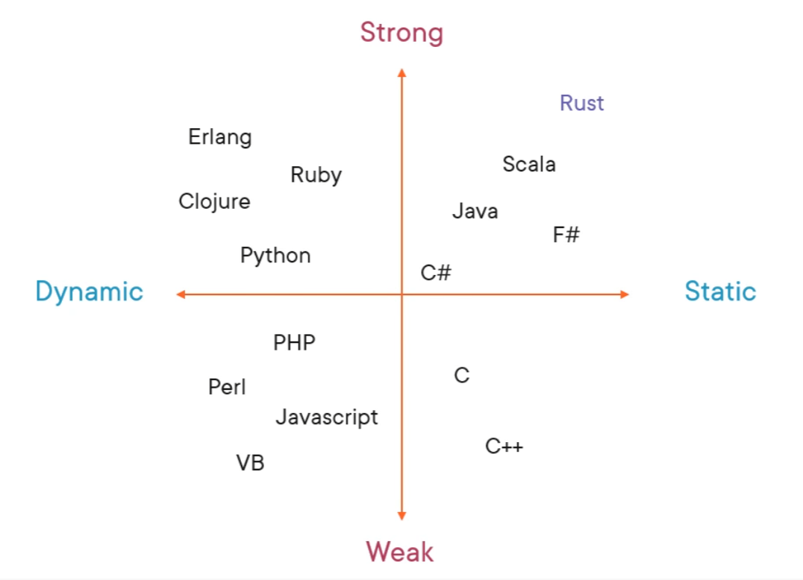
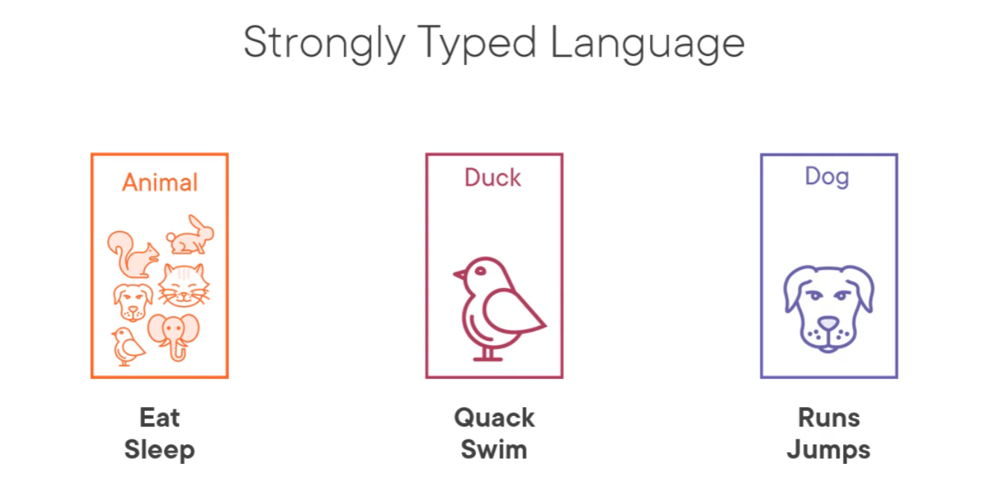
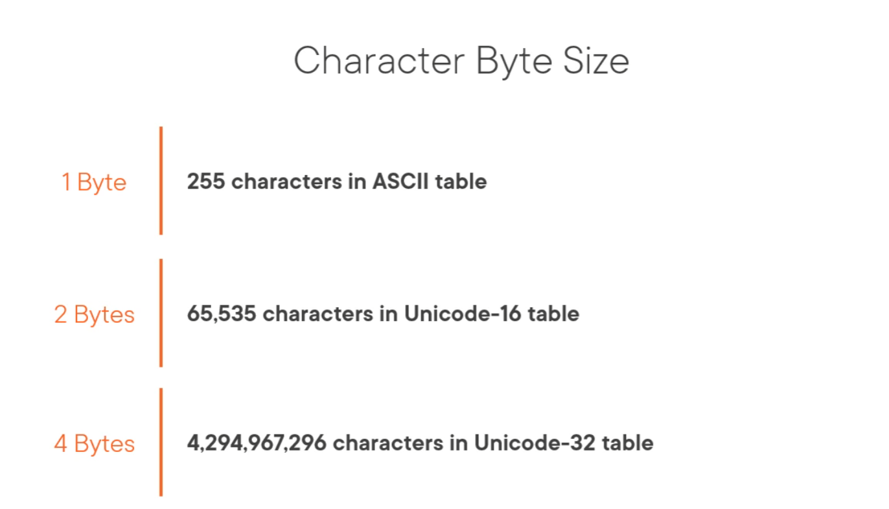
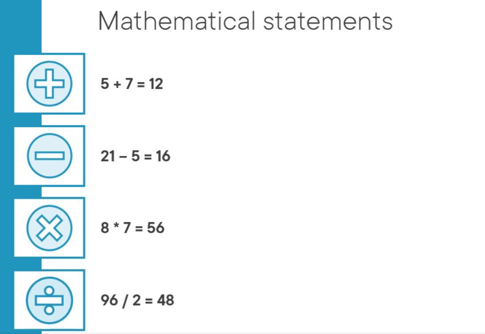
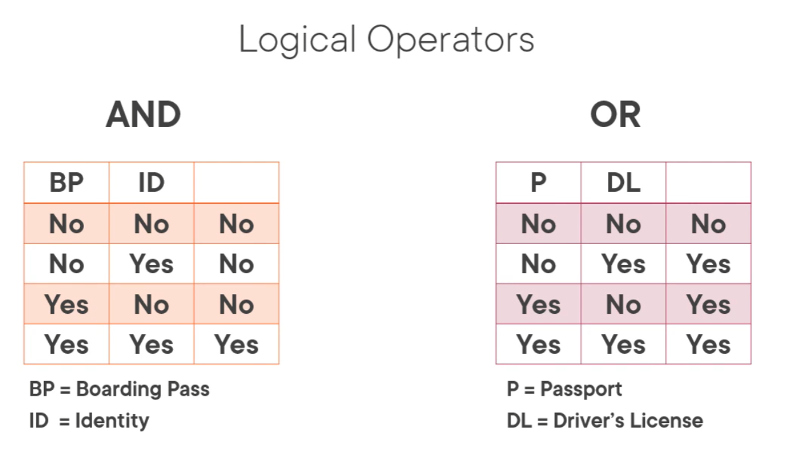

# Rust Fundamentals
### By Edward Curren on Pluralsight
**Released on Jan 25th 2022**
### Notes by Giovanni G. D'Amico

## Index


- [0-0](#personal-forward) **Personal Forward**
- [1-0](#introduction--setup) **Introduction & Setup**
  - [1-1](#the-project) The Project
  - [1-2](#development-environment-setup) Development Environment Setup
  - [1-3](#anatomy-of-a-rust-program) Anatomy of a Rust Program
  - [1-4](#static-vs-dynamic-and-compiled-vs-interpreted) Static vs Dynamic and Compiled vs Interpreted
  - [1-5](#stack-vs-heap) Stack vs Heap
- [2-0](#data-types) **Data Types**
  - [2-1](#number-types) Number Types
  - [2-2](#characters-and-booleans) Characters and Booleans
  - [2-3](#arrays-and-tuples) Arrays and Tuples
  - [2-4](#strings-and-string-slices) Strings and String Slices
  - [2-5](#string-concatination) String Concatination
- [3-0](#variables) **Variables**
  - [3-1](#vars) Vars
  - [3-2](#casting-data-types) Casting Data Types
  - [3-3](#variable-mutability) Variable Mutability
  - [3-4](#scope-and-shadowing) Scope and Shadowing
- [4-0](#operators) **Operators**
  - [4-1](#math-operators) Math Operators
  - [4-2](#logic-operators) Logic Operators
  - [4-3](#bitwise-operators) Bitwise Operators
  - [4-4](#project-part-1) Project Part 1
- [5-0](#control-flow) **Control Flow**
  - [5-1](#if/else) If/Else
  - [5-2](#enum) Enum
  - [5-3](#option) Option
  - [5-4](#match-statements) Match Statements
  - [5-5](#match-with-enumerations) Match with Enumerations
  - [5-6](#if-let) If Let
  - [5-7](#rust-loops) Rust Loops
  - [5-8](#while-loops) While Loops
  - [5-9](#for-loops) For Loops
  - [5-10](#project-part-2) Project Part 2
- [6-0](#ownership-and-borrowing) **Ownership and Borrowing**
  - [6-1](#memory-management) Memory Management
  - [6-2](#ownership) Ownership
  - [6-3](#borrowing) Borrowing
  - [6-4](#lifetimes) Lifetimes
- [7-0](#functions-and-error-handling) **Functions and Error Handling**
  - [7-1](#functions) Functions
  - [7-2](#ownership-&-borrowing-with-functions) Ownership & Borrowing with Functions
  - [7-3](#closures) Closures
  - [7-4](#error-handling) Error Handling
  - [7-5](#result-enum) Result Enum
  - [7-6](#error-propagation) Error Propagation
- [8-0](#data-structures-&-traits) **Data Structures & Traits**
  - [8-1](#data-structures) Data Structures
  - [8-2](#associated-methods) Associated Methods
  - [8-3](#traits) Traits
- [9-0](#collections) **Collections**
  - [9-1](#sequences) Sequences
  - [9-2](#vectors) Vectors
  - [9-3](#vector-double-ended-queue) Vector Double Ended Queue
  - [9-4](#maps) Maps
  - [9-5](#sets) Sets
- [10-0](#generics) **Generics**
  - [10-1](#generic-types) Generic Types
  - [10-2](#constraints) Constraints
- [11-0](#concurrency) **Concurrency**
  - [11-1](#concurrency-hazards) Concurrency Hazards
  - [11-2](#creating-threads) Creating Threads
  - [11-3](#thread-communication) Thread Communication
  - [11-4](#where-to-go-from-here) Where to go from here
- [12-0](#crates-&-modules) **Crates & Modules**
  - [12-1](#modules) Modules
  - [12-2](#cargo.toml) Cargo.toml
  - [12-3](#cargo-fundamentals) Cargo Fundamentals
  - [12-4](#publishing-crates) Publishing Crates
- [13-0](#conclusion) Conclusion

## **Personal Forward**
[](#index)


Hey just wanted to jut in, Im very happy that Pluralsight has finally decided to host a video on rust. I was surprised to see the upload and got very excited to dip my toes once again into rust. When I initially tried to learn, I was almost exclusively using the documentation. To be honest, the documentation wasn't bad but I felt kinda alone trying to figure things out.

If I have my own 2 cents on anything i'll preface it with an "**MHZ**:" obviously most of this is based on the video by Edward Curren so I want to preserve his intake throughout this document.

## **Introduction & Setup** 
[](#index)


The Two Questions we ask ourselves when learning something new:
1. What is this?
2. Why should we care?

To answer the first on behalf of Rust, Rust is a language that is built on Safety & Speed.
- Speed
  - Its programs can typically run as fast or faster than C++ programs.
  - writing Concurrent(making use of multiple CPU Cores) is trivial.
- Safety
  - Rust Memory Management is handled by Rust without the need for a garbage collector.
    - Essentially Rust will figure out how to manage memory at compile time.
    - Ergo, if Rust compiles, it will run without error.
- Rust is natively cross-platform
- Rust enforces consistancy which supports governance and makes onboarding easier
  - by being consistant, its easier to maintain.
- Allows mentoring of developers to focus on areas other then defensive coding.
  - Your compiler is a great teacher
  - **MHZ**: He aint kidding, Ive never seen a more verbose and descriptive compiler.

**So Whats the Catch?**
  - Rust has a steep learning curve
  - You must approach learning code in a different way

**That Being Said:**
  - Rust is one of the most loved languages in the last several years
  - It's a good time to learn rust because big companies are investing in Rust's Future.


### **The Project** 
[](#index)

Throughout the Video we will be working on a number of projects to help better understand the material

The Premise behind the Projects:
  We are hired by **Duck Airlines** which is proud to say they have a 100% Landing Rate. So Much so, that their mottos is:

  **"Duck Airlines, we hit the ground every time"**

  They have hired us to create an application that will caluclate the great circle route distance between two airports.

### **Development Environment Setup** 
[](#index)

**MHZ**: I already have rust installed so im mostly gonna just glance through this.

You have your 3 flavors of Rust Compilers, Rust Stable, Rust Beta and Rust Nightly. Rust Stable and Beta are released once every 6 weeks with Nightly being released every night.

**MHZ**: There is actually a bit more to this. Nightly will always contain features that the Rust Development team doesn't believe meets the standards of the Beta and Stable. There are a handful of frameworks that only work with Nightly.<br>
On the other hand, Beta, unless the feature is deemed otherwise, will usually be a reflection of what features Stable will eventually have.

You'll need to download rustup which is the toolchain management utility for Rust from [here](https://rustup.rs). Follow the instructions for your OS and if it worked you should be able to type out `rustc --version` and get the version on your machine.

For Windows, you will need to install the C++ build tools for Visual Studio 2013 or later. you can either install Visual Studio 2019/17/15/13 and install the C++ tools in the installer or get the tools directly [here](https://visualstudio.microsoft.com/visual-cpp-build-tools)

if Rust generated this error, once you have the needed tools installed, you should be able to run through the install clean by running it again.

Once you have that installed you'll need an IDE of some sort. Jetbrains IntelliJ IDEA is the IDE that will be used for this program.
link to installation is [here](https://jetbrains.com/idea/download)
**MHZ**: Maybe im a bit vanilla but im just using VS Code. its good software and i've found myself wanting to use it with as many languages as I can. you can find VSC [here](https://code.visualstudio.com)

Finally you can also use the rust playground if you want something closer to a Repl [here](https://play.rust-lang.org)

### **Anatomy of a Rust Program** 
[](#index)

Every program will have an entry point and for rust that will be the `main()` function.
  - `fn` is used to define a function.
  - you can only ever have ONE `main()` function. if there were multiple `main()` functions in your application, the compiler will not know what is your entry point and rust will just fail to compile.
  - in C fashion, curlys `{}` are used to wrap the definition of a function.
```rust
fn main() {
  println!("Hello World!");
}
```
as seen in other c languages, `println` will print the line provided into your console. the exclamation point at the end designates println as a `macro` and not a `function`. we will cover macros later but it is essentially a piece of code within a function.

to continue with the example, we can add a line at the top that will skip any errors involving unused variables, for the purposes of development, this can be handy to quickly compile and test without being bombarded with warnings. `#![allow(unused_variables)]`
if we do compile the code we get this warning but it will compile:

```bash
Compiling rust_fund_one v0.1.0 (C:\Users\HavocZephyr\Documents\Projects\rust_projects\2022\rust_notes\rust_fund_one)
warning: unused variable: `unused_var`
 --> src\main.rs:4:9
  |
4 |     let unused_var: u32 = 0;
  |         ^^^^^^^^^^ help: if this is intentional, prefix it with an underscore: `_unused_var`
  |
  = note: `#[warn(unused_variables)]` on by default

warning: `rust_fund_one` (bin "rust_fund_one") generated 1 warning
    Finished dev [unoptimized + debuginfo] target(s) in 0.87s     
     Running `target\debug\rust_fund_one.exe`
Hello, world!
```

### **Static vs Dynamic and Compiled vs Interpreted** 
[](#index)



this graph here helps better understand the comparisons between languages

- a statically typed language is where we know the types of the data at compile time.
- on the latter end, a dynamically typed language is one where the data is not concluded on until runtime. additionally a variable can hold any time of value until runtime.
- strong typing enforces rules on data type assignments.
- a weakly typed or loosely type language has no strong rules on what typing a variable has.

to better understand this, im going to go with an object oriented concept called inheritance.



in this case:
- we have a grouptype called `Animal`, which can eat and sleep.
- then we have `Duck`, which can eat and sleep but also quack and swim.
- and finally we have `Dog`, which can also eat and sleep but can also run and jump.

IF we have a variable that has been assigned the type of `Animal`, then it is probably fine to also assign it one of its child types, like `Duck` or `Dog`, depending on what fits best.

However, this would not work in the inverse, you can't just assign a variable as a `Dog` and then assign it `Animal`.

**MHZ**: this was kinda confusing :\

because Rust has such a strong emphasis on typing, Rust heavily leans on safety and reliability.

Because Rust compiles, the executable is generated at compile time and is essentially machine code.
the alternative is being interpreted, which means that the language is processed by an `interpreter` at runtime and will be processed on the fly. this has its benefits of being usable anywhere but is much much slower then a compiled .exe

additionally compiled rust executables are already usable on any OS and still incredibly fast.

### **Stack vs Heap** 
[](#index)

When we start talking about variable values, we will hear about data being stored in the stack or in the heap. 

if you were to imagine a stack of plates. you know that when people typically take plates off the top in order from top to bottom. first one in, last one out. thats essentially what the stack is in Computer logic. 

the stack is a layered collection of in memory addresses that are being processed one at a time in the order it was executed. whereas the heap is the data in memory.

the stack isn't that big to begin with so if you overload the stack, you'll crash the OS and run into a `Stack Overflow` (roll credits)

to access data from the heap, we use pointers in the stack to essentially point to the location of memory from the stack. thus making it immediately accessable.

this type of information will be valuable later once we get into ownership and borrowing.

## **Data Types** 
[](#index)


for data types we will be talking about scalar and compound data types. Scalar being able to hold only a single value, wheras Compound can hold multiple values. we will look at scalars such as numbers characters and bools. then we will look at the compound data types, tuples and arrays and finally we will take a look at strings.

### **Number Types** 
[](#index)

**Primative Data Types:**: Data types that are built into the language and are stored on the stack.

**Integer**: INT's are all whole numbers negative or positive. however in the case of rust, if the number IS negative it needs to be classified as a signed integer `i` instead of it being unsigned `u`, meaning that it has a sign associated with the number, negative or positive. the benefits of using an unsigned integer is that the maximum size of the value is doubled.
so in the case of an 8 bit integer:
- an unsigned integer `u8` can have a value from 0 to 255.
- a signed integer `i8` can have a value from -128 to 127.

for Rust we will be using between 8 and 64 bits, if you wanted to use 128 bits you would need to use the nightly version of rust.
**MHZ:** granted, you prolly will never need to use numbers that big, those values would be incredibly massive.

finally we have `isize` and `usize` which are tied to CPU architecture, typically used with Memory Addressing.

**Floating Point Numbers**: floats are represented as `f32` and `f64`. all float values are signed so there is no unsigned floating point data types in Rust.


### **Characters and Booleans** 
[](#index)

Last two primative data types are Booleans & Characters.

- Booleans are True and False.
- Characters are letters and numbers. they are ultimately saved as numbers.
  - As to what numbers are used to save each character depends on if you are using ASCII tables or Unicode tables.
  - depending on how it is stored, characters are on average about 2 bytes, and can be up to around 4 bytes.
    - we want to know the byte size of a character because that dictates what character we can use.



### **Arrays and Tuples** 
[](#index)

- Arrays & Tuples are considered our basic compound data types.
  - Arrays are a list of one data type.
  - Tuples are a list of many different data types.

**Please Refer to rust_fund_two for an interactive version of this section.**

In rust, you must define the size of the data prior to initializing the array or tuple.
that looks as so:
```rust
//for tuples:
let tup_var:(&str, f64, f64) = ("string", 1.001, 2.002)

//for arrays:
let arr_var:[f32;2] = [3.2, 2.2]
```
you can also destructure tuples and arrays to give values to those numbers like so:
```rust
let (name, latitude, longitude) = location;
    println!("Location name: {}, latitude: {}, longitude:{}", name, latitude, longitude);
```
this will preserve the value and allow you to call each value by its given name.

### **Strings and String Slices** 
[](#index)

If your coming from another language you might be a little honked off with the way Rust makes you work with strings. (**MHZ:**It's at least better then Java) remember the pillars of Rust:

- Speed
- Concurrency
- and Memory Safety.

there are two types of Strings
Strings - notated with a capital S
and String Slices - notated as &str

String | &str
-- | --
Vector of u8 Data | Vector of u8 data
Mutable | Immutable
Stored on the heap | Can be stored on the heap, stack or embedded in the compiled code.

**Please Refer to rust_fund_three for an interactive version of this section.**

```rust
let var:&str = "Donald Mallard";
// this is a string slice
let var2:String = var.to_string();
// we convert the string slice into a string.
```
while we are talking about string slices here, one of the tricky aspects of rust is string literals, or hard coded strings. these are specifically embedded into the code. in order to assign a string literal to a type of string, we need to call the to_string method on the string literal.

```rust
let var3:String = "Donald Mallard".to_string();
```
*MHZ:* I'm confused on this material, i'll come back to later.

another way we can convert a string_slice to a string is through the from string method:
```rust
let var4:String = String::from(s:"Donald Mallard");
```
alternatively, if we wanted to convert a string to a string slice

```rust
let var4:&String = &var
let var5: var.as_str();
```
this goes back to pointers when we store data on the heap, we use a pointer in the stack to locate the data on the heap. there are a couple of special symbols we use with pointers. which are asterisks(*) and ampersands(&).

### **String Concatination** 
[](#index)

in some languages, when we want to combine strings together we perform some sort of addition formula which binds the two strings into a single line. this is called concatenation.

```js
myString = string1 + string2
```
things get complicated here so it might be ideal to come back to this section later once you through ownership and borrowing.

**Please Refer to rust_fund_four for an interactive version of this section.**

```rust
    let duck = "Duck";
    let airline = "Airlines";
    //this is one way of combining string slices together.
    let airline_name = [duck, " ", airline].concat();
```
by using `concat()` we can combine both string slices into a single string.
we can also use `format!()`

```rust
let airline_name_two = format!("{} {}", duck, airline);
```
to accomplish similar concatenation.

```rust
let mut slogan = String::new();
    slogan.push_str("We hit the ground");
    slogan.push(' ');
    slogan = slogan + "every time";
```


## **Variables** 
[](#index)


- We're gonna look at how to declare a variable.
- We're gonna look at how to change a variable.
- we'll look into var immutability.
- and variable scope and shadowing.


### **Vars** 
[](#index)

we can think of a variable as a container for a piece of data. we give it a name, what type of data will be inside of it. then invoke it later when needed.

```rust
//the let keyword tells the rust compiler that we are declaring a variable.
let my_variable_name:u32 = 0;
// you can omit the type of data it is, and rust will ascertain the type from the value you enter.
let my_inferred_variable = 0;
// in vsc, if you hover over the value, it will tell you that it is an int value.
// you'll notice that rust will asign a value like 0 as a signed 32bit integer (i32). this is the default value rust will give integers.
let my_inferred_variable = 1.0;
// in this case, rust will assign the value as a 64bit float. f64.
let my_inferred_variable = 1_i8;
// at least with numbers, this is another way you can imply what kind of value it is.
let _my_unused_variable = 0;
// if your going to have a variable in your code that is not used, affix an "_" to prevent the compiler from getting upset about it.
```

### **Casting Data Types** 
[](#index)

we're gonna talk about changing the data type of a variable.

**Please Refer to rust_fund_five for an interactive version of this section.**

```rust
fn main() {
    let float_thirty_two: f32 = 17.2;
    let unsigned_eight:u8 =5;

    let result = float_thirty_two / unsigned_eight;
}
```
the compiler will not like this. both values are numerical but the typing is too different for it to process. rust will not do what's called "Implicit Casting" from one data type to another. we need to do Explicit casting.

```rust
let cast_unsigned_eight = unsigned_eight as f32;

let result = float_thirty_two / cast_unsigned_eight;
println!("{}", result);
```
rust will not have any trouble converting a integer into a character, but will have problems converting a float to a character and will get upset at compile.

```rust
let number: u8 = 65;
let letter: char = number as char;
//this works!
```
```rust
let float: f32 = 65.0;
let letter: char = number as char;
//this won't.
```

lets move onto Mutability!

### **Variable Mutability** 
[](#index)
now we get to variable mutability.

to be mutable, means it's changable.
by default, variables are **immutable.**
by putting `mut` into the declaration of a variable, we make the variable **mutable**

```rust
let mut changable_variable = 500;
```
this sits well into rusts ideals of safety concurrency and speed. rust wants to make sure the values you use and the values that will be eventually changed are highly defined.

**MHZ:** this would have been a good time to mention static and constants :\

### **Scope and Shadowing** 
[](#index)

like javascript, variables from the outside, can be used inward into other functions or code blocks but, we cannot go back out. however if you name a variable the same name as a variable on the outside, that is called **shadowing** and the shadowing variable can hold a different value.

```rust
fn main() {
    let scope_test = "outer scope";
    println!("{}", scope_test);
    {
        println!("{}", scope_test);
    }

}
```
"outer scope" would print on both ends.
```rust
fn main() {
    let scope_test = "outer scope";
    println!("{}", scope_test);
    {
        let scope_test = "inner scope";
        println!("{}", scope_test);
    }

}
```
now, scope_test is **shadowed* by the inner scope_test in the code block.
we can shadow variables within the same scope.

```rust
    let scope_test = "outer scope";
    let scope_test = 0;
```
I don't recommend shadowing values while you are learning rust, there is alot going on and you can cause yourself a real headache trying to debug a problem caused by shadowing a variable.

## **Operators** 
[](#index)


we'll be looking at math/logic and bitwise operators!

### **Math Operators** 
[](#index)




computers are math and logic machines and if we look at these simple math questions we got our addition, subtraction, multiplacation and divison these symbols are math operators and we are all very used to these common operators. we additionally have modulus which gives you the remainder of a divided value.

```rust
let modulus = 18 % 7;
println!("{}", modulus);
//the result would be 4
```

one operator that is glaringly missing is the exponent operator, which isn't a problem specifically to rust. there really isn't an exponent operator in most languages. however, there are workarounds.

```rust
let squared = i32::pow(8,2);
println!("{}", squared);
```
we will get the value of 8 by the **power** of 2
however we can only use **pow** with integers, for floating points we need to use different tools `f32::powi(x,y)` or `f32::powf(x,y)`<br>
this was mostly done because the computational power needed to process a float vs processing an integer is somewhat larger. its a much more expensive calculation that reduces its optimal speed.

```rust
let float_integer = f32::powi(6.5, 3);
let float_float = f32::powf(6.5, 3.14);
```
PEMDAS still matters here in code, the order of operations will take place when processing a mathematical calculation.

```rust
let order_ops= 8+4*2-(12/3+7)+4;
```
the awnser is 9.

### **Logic Operators** 
[](#index)

the next operators are logic operators where we test one value to another, in other words, comparitors.

```rust
let are_equal_is_true = 1 == 1;
let are equal_is_false = 1 == 2;
```
in each case we are trying to see if 1 = 1, which is true, and 1 = 2, which is false.

`==` is used to compare values. next we will look at `!` which is often called bang. but its usually paired with comparitors to equate inequality.

```rust
let are_not_equal = 1 != 2;
```
in this case, 1 does not equal 2, and thus it is true.

```rust
let is_true = true;
let is_false = !is_true;
```
so in this case, the boolean `is_true` is true, so by making `is_false = !is_true;` it will be the opposite of `is_true`. which by proxy makes it `false`.

we can also use the logical AND & OR operators.



and and or are used very often even in our own daily lives. If we needed to fly out of an Airport, boarding security would require us to have both our Boarding Pass **and** ID. if we didn't have a boarding pass, but had our ID, or had our boarding pass, but didn't have our ID. that would all be the same as not having either. alternatively if we use the logical or, where we are using our passport **or** our drivers license to verify ID, we can use both or just one to be true.

```rust
let have_boarding_pass = true;
let have_id = true;
let can_board = have_boarding_pass && have_id;
```
by using `&&` we perform the logical AND operation between `have_boarding_pass` and `have_id` and therefore, the result is: `true`.
if we change the value of `have_boarding_pass` to  `false`. then `can_board` will result in `false`.
### **Bitwise Operators** 
[](#index)

wex quas exort

### **Project Part 1** 
[](#index)

wex quas exort

## **Control Flow** 
[](#index)


wex quas exort

### **If/Else** 
[](#index)

wex quas exort

### **Enum** 
[](#index)

wex quas exort

### **Option** 
[](#index)

wex quas exort

### **Match Statements** 
[](#index)

wex quas exort

### **Match with Enumerations** 
[](#index)

wex quas exort

### **If Let** 
[](#index)

wex quas exort

### **Rust Loops** 
[](#index)

wex quas exort

### **While Loops** 
[](#index)

wex quas exort

### **For Loops** 
[](#index)

wex quas exort

### **Project Part 2** 
[](#index)

wex quas exort

## **Ownership And Borrowing**
[](#index)


wex quas exort

### **Memory Management** 
[](#index)

wex quas exort

### **Ownership** 
[](#index)

wex quas exort

### **Borrowing** 
[](#index)

wex quas exort

### **Lifetimes** 
[](#index)

wex quas exort

### **Project Part 1** 
[](#index)

wex quas exort

## **Functions and Error Handling** 
[](#index)

wex quas exort

### **Functions** 
[](#index)

wex quas exort

### **Ownership and Borrowing With Functions** 
[](#index)

wex quas exort

### **Closures** 
[](#index)

wex quas exort

### **Error Handling** 
[](#index)

wex quas exort

### **Result Enum** 
[](#index)

wex quas exort

### **Error Propagation** 
[](#index)

wex quas exort

## **Data Structures & Traits** 
[](#index) 


wex quas exort

### **Data Structures** 
[](#index)

wex quas exort

### **Associated Methods** 
[](#index)

wex quas exort

### **Traits** 
[](#index)

wex quas exort

## **Collections** 
[](#index)


wex quas exort

### **Sequences** 
[](#index)

wex quas exort

### **Vectors** 
[](#index)

wex quas exort

### **Vector Double Ended Queue** 
[](#index)

wex quas exort

### **Maps** 
[](#index)

wex quas exort

### **Sets** 
[](#index)

wex quas exort

## **Generics** 
[](#index)


wex quas exort

### **Generic Types** 
[](#index)

wex quas exort

### **Constraints** 
[](#index)

wex quas exort

## **Concurrency** 
[](#index)


wex quas exort

### **Concurrency Hazards** 
[](#index)

wex quas exort

### **Creating Threads** 
[](#index)

wex quas exort

### **Thread Communication** 
[](#index)

wex quas exort

### **Where To Go From Here** 
[](#index)

wex quas exort

## **Crates & Modules** 
[](#index)


wex quas exort

### **The Project** 
[](#index)

wex quas exort

### **Modules** 
[](#index)

wex quas exort

### **Cargo.toml** 
[](#index)

wex quas exort

### **Cargo Fundamentals** 
[](#index)

wex quas exort

### **Publishing Crates** 
[](#index)

wex quas exort

## **Conclusion** 
[](#index)


wex quas exort

